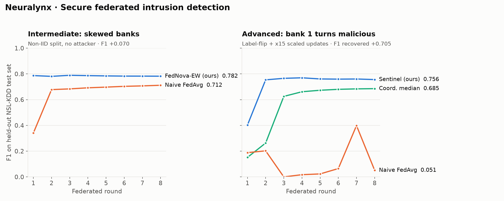

# Neuralynx — Secure AI Hackathon (CAIRLab), Days 2–3

Federated intrusion detection across five simulated banks on NSL-KDD.

| Track | Before | After | Change |
|---|---|---|---|
| 🔴 **Advanced (primary)** — client 1 label-flips and scales its update ×15 | Naive FedAvg under attack: **F1 0.0511** | **Sentinel: F1 0.7560** | **+0.7049 F1 recovered** |
| 🟡 Intermediate — skewed (non-IID) banks, no attacker | Naive FedAvg: **F1 0.7117** | **FedNova + equal weights: F1 0.7821** | **+0.0704 F1** |

Numbers are from the official notebook run (seed 42) on the held-out NSL-KDD test set
(`KDDTest+`, 22,544 rows). 5-seed means are in `results.json` and in the notebook.



## Files

| File | What it is |
|---|---|
| `Neuralynx_SecureAI_Day2.ipynb` | The organizers' Day 2 notebook with our work in the two `YOUR TURN` hooks, fully executed |
| `model_scripted.pt` | **Final exported model** (Sentinel, advanced track) — TorchScript, takes the 41 preprocessed features |
| `submission.json` | Metrics file produced by the notebook's submission cell |
| `model_intermediate_scripted.pt` | Supporting: the FedNova-uniform model (intermediate track) |
| `results.json` | All before/after numbers, 5-seed ablation, stress test, per-round detection log |
| `cover.png` | Writeup cover image |
| `f1_over_rounds.png` | F1-over-rounds chart for both tracks (generated by the notebook) |
| `WRITEUP.md` | Copy of the Kaggle Writeup |

## Reproduce

```bash
python -m venv .venv && source .venv/bin/activate   # Windows: .venv\Scripts\activate
pip install -r requirements.txt
jupyter nbconvert --to notebook --execute --inplace Neuralynx_SecureAI_Day2.ipynb
```

The notebook downloads NSL-KDD from the public GitHub mirror used by the organizers, so it
needs internet access. It runs on CPU in about 5 minutes. It regenerates
`model_scripted.pt`, `submission.json`, `results.json` and the chart. It also works as-is on
Kaggle or Colab.

Every before/after pair calls `reseed()` first, so both runs start from the same initial
weights and batch order. That makes the comparison paired and reproducible.

### Verify the exported model

```python
import torch
m = torch.jit.load("model_scripted.pt")   # forward(x): (N, 41) float tensor -> (N,) logits
```

Feed it `test_df[FEATURE_COLS]` exactly as built in Section 1 of the notebook. Threshold
`sigmoid(logit) > 0.5`. Expected F1 = **0.7560**.

## Methods in one paragraph each

**FedNova + equal weights (intermediate).** Non-IID banks take very different numbers of
local SGD steps (25 to 189). FedAvg therefore over-weights the bank that drifted furthest and
converges to a skewed objective. We divide each update by its local step count (FedNova) and
average with equal per-bank weights.

**Sentinel (advanced).** Every round, Sentinel computes each bank's step-normalised update
norm relative to the median. It excludes banks above 5× the median and records a strike.
After 2 strikes a bank is quarantined for the rest of training. Every surviving update is
clipped to 2× the median. The survivors are then aggregated with FedNova + equal weights.

Stress-tested against ×3, ×15 and ×50 scaling, two colluding attackers, and a pure label
flip. It detected the attacker in every scaled-attack round (34/40 at ×3) and **never
excluded an honest bank**.
